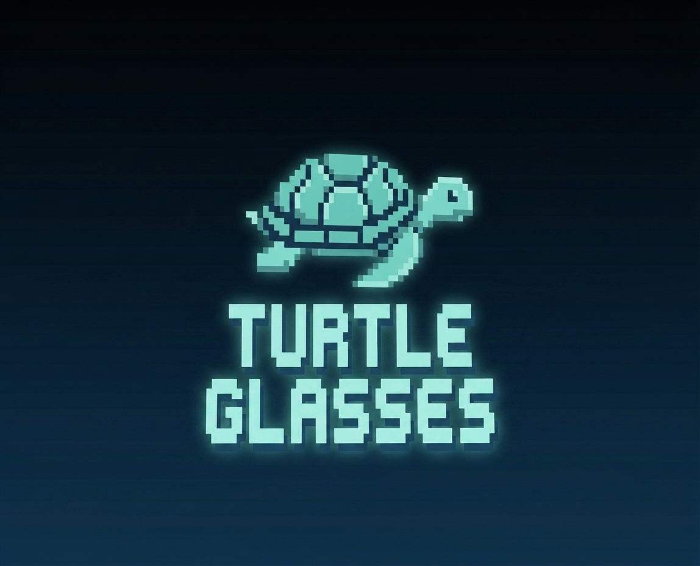
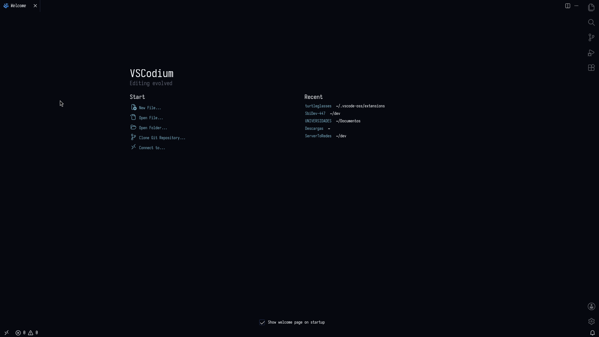
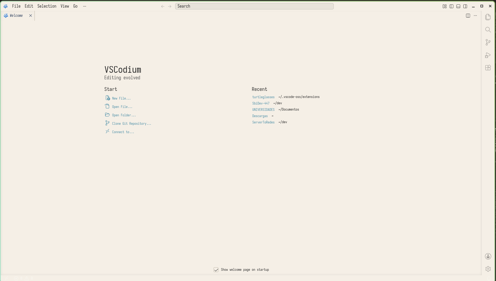

<div align="center">



# 🐢 Turtle Glasses Theme

*Flavours for real eye care* 👓

[]()
[](LICENSE)

</div>

A carefully crafted color theme for Visual Studio Code and VSCodium, designed with eye comfort in mind. Inspired by the calmness of turtles and the clarity of well-made glasses.

## 🖼️ Previews




## ✨ Features

- 🌙 **Dark & Light flavours** — choose what suits your environment
- 🎨 **Carefully selected palette** — colors that are easy on the eyes
- 🔍 **High contrast where it matters** — code is always readable
- 🧠 **Semantic highlighting** — smarter syntax coloring via standard VS Code token types
- 🎯 **Complete UI coverage** — editor, terminal, breadcrumbs, settings, notifications, peek view, merge editor and more
- 🐢 **Turtle-approved** — tested for long coding sessions

## 📦 Installation

### Visual Studio Code (Marketplace)

1. Open the **Extensions** view (`Ctrl+Shift+X`).
2. Search for **Turtle Glasses Theme**.
3. Click **Install**.
4. Press `Ctrl+K Ctrl+T` and select **Turtle Glasses Dark** or **Turtle Glasses Light**.

### VSCodium / Manual (VSIX)

1. Download the `.vsix` file from the [Releases](https://github.com/SbiDev-447/TurtleGlassesVSCode/releases) page.
2. In VS Code / VSCodium, go to **Extensions** → `...` menu → **Install from VSIX...**.
3. Select the downloaded file and reload the window.

### From source

```bash
git clone https://github.com/SbiDev-447/TurtleGlassesVSCode.git
cd TurtleGlassesVSCode
npm install
npm run package   # produces turtle-glasses-theme.vsix
```

## 🎨 Palette

### Dark

| Token | Color |
| ----- | ----- |
| Editor background | `#06080f` |
| Editor foreground | `#f3f6f9` |
| Cursor | `#e0c15a` |
| Selection | `#263356` |
| Line numbers | `#3a4a75` |
| Status bar | `#263356` |

### Light

| Token | Color |
| ----- | ----- |
| Editor background | `#f5efe6` |
| Editor foreground | `#2a2a2a` |
| Cursor | `#b8860b` |
| Selection | `#2a3d5c` |
| Line numbers | `#b8b0a0` |
| Status bar | `#2a3d5c` |

## 👀 Recommended settings

For the best experience, consider enabling semantic highlighting:

```json
{
  "editor.semanticHighlighting.enabled": true,
  "editor.bracketPairColorization.enabled": true,
  "editor.guides.bracketPairs": true
}
```

## 📄 Changelog

See [CHANGELOG.md](CHANGELOG.md) for the full release history.

## 🐛 Issues & Feedback

Found a bug or have an idea? Open an [issue](https://github.com/SbiDev-447/TurtleGlassesVSCode/issues).

## 🙏 Acknowledgments

Inspired by the structure of [Kanagawa Theme](https://github.com/rebelot/kanagawa.nvim) and Gentleman.

## 📄 License

This project is licensed under the [MIT License](LICENSE).

---

<div align="center">
Made with ❤️ and 🐢 by [SbiDev-447](https://github.com/SbiDev-447)
</div>